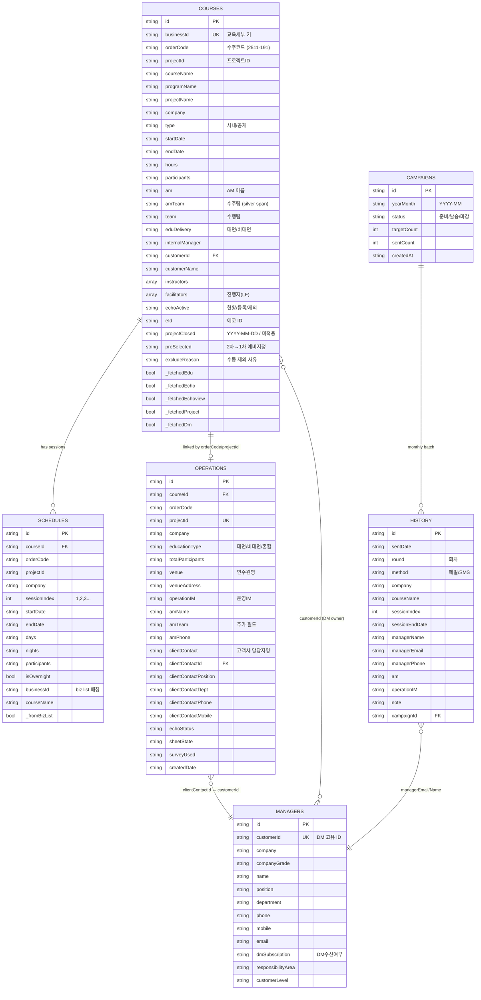
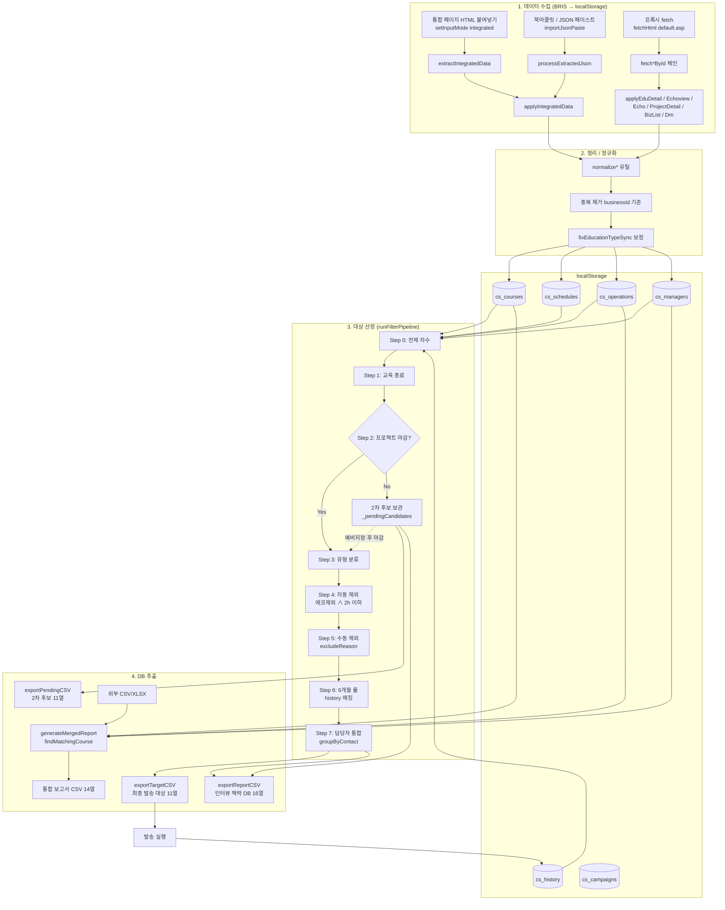
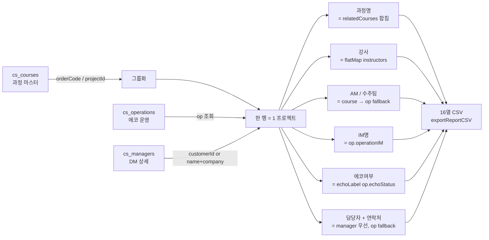
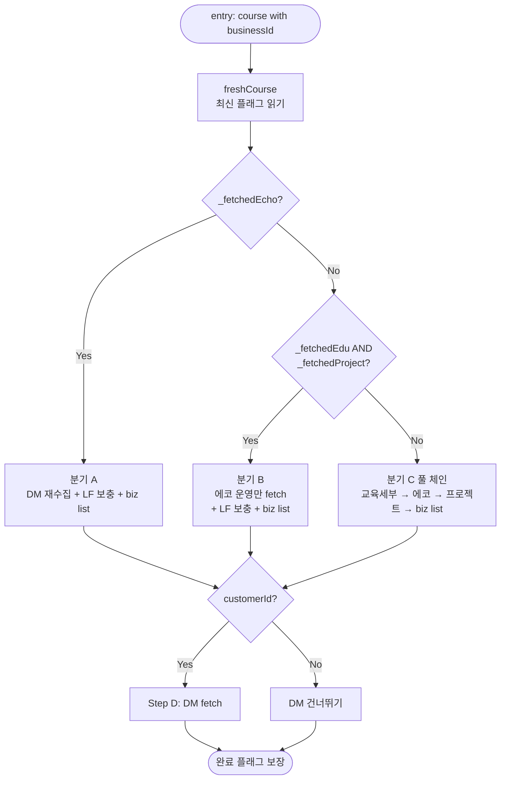
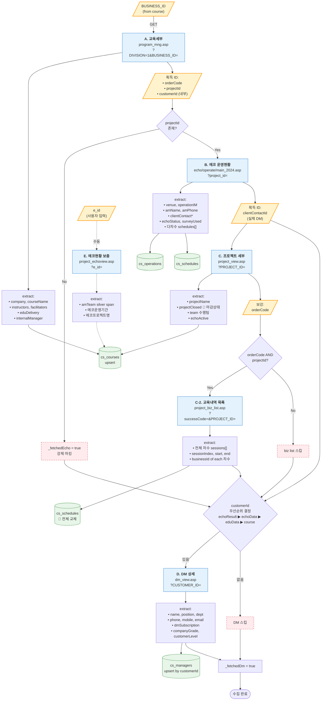
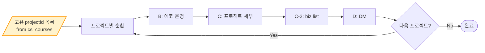

# CS 사후 설문 대상자 관리 — 데이터 플로우 & ERD (v1)

> **v2 재설계 진행 중** — 신규 설계 스펙은 [`data_model_v2.md`](./data_model_v2.md) 참조. 이 문서는 v1 (현재 동작 중 구조) 기록용으로 보존.
>
> 대상 파일: `index.html` (단일 HTML, localStorage 기반)
> 생성일: 2026-04-13

---

## 1. 데이터 수집 계층 (주 + 보조)

BRIS는 사내 보안 정책상 외부에서 자동 fetch 불가 → **사용자가 브라우저에서 BRIS 페이지를 열고 HTML을 붙여넣는 방식**을 기본으로 합니다. 동일 서버(`onepage.exc.co.kr/cs_master/`)에 배포된 경우에는 `/default.asp?bris_proxy=` 프록시로 반자동 수집도 가능합니다.

### 주(主) 수집 — 통합 페이지

| 항목 | 값 |
|---|---|
| 함수 | `extractIntegratedData()` `index.html:2190` → `applyIntegratedData()` `index.html:2326` |
| 소스 | 컴플레인참조 통합 페이지 (한 번에 전체 과정 목록 + 기본 필드) |
| 추출 필드 | `businessId`, `orderCode`, `projectId`, `company`, `courseName`, `programName`, `startDate`, `endDate`, `eduDelivery`, `am`, `amTeam`, `performerTeam`, `instructor`, `echoStatus`, `projectClosed`, `echoId`, DM(`dmName/Dept/Email/Phone/Mobile`, `customerId`) |
| 쓰기 대상 | `cs_courses` (upsert), `cs_managers` (upsert), `cs_operations` (없으면 기본 레코드 생성) |
| 특징 | **한 번에 다건**. UI의 기본 입력 모드 (`currentInputMode = 'integrated'`) |

### 보조 수집 — 개별 페이지 (ID 기반 후속 보강)

자동 수집 체인 `autoFetchCourse()` `index.html:3380` 이 한 과정(course)에 대해 순차적으로 아래 파이프라인을 돌립니다.

| # | 소스 페이지 | 추출 함수 | 적용 함수 | 보강 필드 · 용도 |
|---|---|---|---|---|
| 1 | `education_view.asp` (교육세부) | `extractEduDetailData` `:1524` | `applyEduDetailData` `:2461` | 강사·진행자(LF)·`eduDelivery`(대면/비대면)·`customerId`·내부담당자 |
| 2 | `project_view.asp` (프로젝트 세부) | `extractProjectDetailData` `:1944` | `applyProjectDetailData` `:2581` | `projectClosed`(마감상태), `projectName`, `echoActive` |
| 3 | `project_biz_list.asp` (전체 차수) | `extractProjectBizList` `:2007` | `applyProjectBizList` `:2057` | 차수별 startDate/endDate 정본 → `cs_schedules` **교체** |
| 4 | `project_echoview.asp` (에코현황) | `extractEchoviewData` `:1628` | `applyEchoviewData` `:1746` | `eId`, `amTeam`(silver span), 운영기간, 고객사 담당자 raw |
| 5 | `echo_view_edit_eco` (에코 운영상세) | `extractEchoData` `:1786` | `applyEchoData` `:2507` | `venue`, `operationIM`, `amName/Phone`, `clientContact*`, `echoStatus`, `sheetState`, `surveyUsed`, **다차수 schedules** |
| 6 | `dm_view.asp` (DM 상세) | `extractDmData` `:2108` | `applyDmData` `:2601` | `name/position/department/phone/mobile/email/dmSubscription/customerLevel` |

각 과정 객체의 `_fetched*` 플래그(`_fetchedEdu`, `_fetchedEcho`, `_fetchedEchoview`, `_fetchedProject`, `_fetchedDm`)로 **중복 수집 방지** + 수집 진행률 표시에 활용됩니다.

### 입력 경로 (UI)

1. **HTML 붙여넣기** — `setInputMode('integrated' | 'bris' | 'json')` `index.html:3080`
2. **북마클릿** — `generateBookmarkletCode()` `:3795` 로 BRIS 페이지에서 JSON을 추출 → `localStorage` storage 이벤트로 수신 (`:3973`)
3. **클립보드/페이스트** — `importFromClipboard()` `:3138`, `importJsonPaste()` `:4000`
4. **프록시 fetch** — `fetchHtml()` `:3233`, `fetchHtmlWithRetry()` `:3328` (동일 서버 배포시)
5. **JSON 복원** — `backupData()` / `restoreData()` `:6161 / :6229`

---

## 2. 정리 (정규화 · 보강) 과정

### 2-1. 필드 정규화 유틸

| 함수 | 역할 | 위치 |
|---|---|---|
| `normalizeText` | NBSP(`\u00a0`) + 전각 공백(`\u3000`) → 일반 공백 + trim | `:1394` |
| `normalizePhone` | 전화/휴대번호 포맷 통일 | `:1427` |
| `normalizeTeamName` | `"201205002 - 변화디자인팀"` → `"변화디자인팀"` | `:1621` |
| `normalizeDate` / `parseBrisDate` | `2025.04.01~07`, `2025-04-01` 등 → ISO `YYYY-MM-DD` | `:1448 / :1457` |
| `parseAmField` | `"장채영 서울2팀"` → `{name, team}` 분해 | `:5870` |

### 2-2. 업서트 정책 (빈 값이면 덮어쓰지 않음)

`applyIntegratedData` 계열 적용 함수는 **비어 있지 않은 값만 덮어쓰기**를 원칙으로 합니다:

```js
if (r.am)     course.am    = r.am;
if (r.amTeam) course.amTeam = r.amTeam;   // 최근 추가
if (r.performerTeam) course.team = r.performerTeam;
```

### 2-3. 매칭 키 (레코드 식별)

| 대상 | 1차 키 | 2차 키 | 3차 키 |
|---|---|---|---|
| Course | `businessId` | `courseName + company` 복합키 | `orderCode` / `projectId` |
| Operation | `projectId` | `orderCode` | `courseId` |
| Schedule | `projectId + sessionIndex` | `startDate + courseId` | — |
| Manager | `customerId` | `name + company` | `email` |

### 2-4. 중복 제거 & 보정

- **중복 제거** — `applyIntegratedData` 끝에서 `businessId` → `courseName||company` 순 우선순위로 `Set` 기반 dedup (`:2438-2445`)
- **교육유형 보정** — `fixEducationTypeSync()` `:6176` 로 `eduDelivery` ↔ `operation.educationType` 불일치 자동 보정
- **스케줄 교체** — `applyProjectBizList`는 biz list를 **정본**으로 간주해 기존 `cs_schedules` 를 전부 교체 (`:2057-2104`)
- **발송이력 만료 정리** — `cleanExpiredHistory()` `:4511` (6개월 경과 항목 제거 + 대상자 복원)

---

## 3. 최종 대상 선정 (Filter Pipeline)

`runFilterPipeline()` `index.html:4708` — 7단계 파이프라인.

| Step | 조건 | 탈락 처리 |
|---|---|---|
| 0 | 전체 차수 (courses × schedules flat join) | — |
| 1 | `sessionEndDate <= today` | 종료 미도래 |
| 2 | `projectClosed !== '미적용'` **OR** `preSelected == true` | **2차 후보**(미마감) 로 보관 |
| 3 | 유형 분류 — `eduType` ∈ {집체, 원격교육, 컨설팅}, `surveyType` ∈ {에코사용, 미사용} | (분류만, 탈락 없음) |
| 4 | `echoActive === '제외' ∧ hours ≤ 2` 는 제외 | 자동 제외 |
| 5 | `course.excludeReason` 가 설정된 과정 제외 | 수동 제외 |
| 6 | 최근 6개월 내 발송된 담당자(`email` / `name+company` / `phone` 매칭) 제외 | 6개월 룰 |
| 7 | `groupByContact()` `:4684` — 동일 담당자 여러 과정 → 메일 1건 | (집계) |

### 최종 대상 DB 추출 — `exportTargetCSV()` `:5785`

**출력 헤더(11열)** — 담당자 단위로 묶여 나옴:

```
담당자 | 회사 | 이메일 | 전화 | 과정(차수) | 최종종료일 | 사업유형 | 교육유형 | AM | 운영IM | 비고
```

- `과정(차수)` 는 여러 건이면 `"리더십과정 1~3차"` 처럼 **연속 차수 축약**
- `AM` / `운영IM` 은 `r.course.am || op.amName` 등 **course → operation 2경로 fallback** 후 `Set` 중복 제거
- UTF-8 BOM 포함 (`downloadCSV()` `:6144`) — 엑셀 한글 깨짐 방지

### 2차 후보 DB 추출 — `exportPendingCSV()` `:5818`

- 교육은 종료되었지만 프로젝트 미마감 상태. 마감 시점에 `preSelected == true` 인 건은 자동으로 1차 대상으로 승격
- 헤더에 `마감상태` 추가

---

## 4. 인터뷰용 맥락 DB (과정 + 관계자 + DM + 운영:에코)

인터뷰/리포트 작성을 위한 넓은 컨텍스트 뷰는 두 경로로 제공됩니다.

### 4-1. 시스템 직접 출력 — `exportReportCSV()` `:5853`

필터링 결과 (1차 + 2차 후보) 를 **프로젝트 단위**로 묶어 한 행으로 내보냅니다.

**출력 헤더(16열)**:

```
구분 | 프로젝트코드(bar코드) | 프로젝트명 | 과정명 | 고객사명(사업장)
 | 교육유형 | 에코여부 | AM | 수주팀 | 수행팀 | 참여 강사명 | IM명
 | 고객사 담당자명 | 직책 | 연락처 | 이메일
```

**결합 로직** (`buildRows` `:5877-5904`):

1. `courses` 를 `orderCode || projectId` 로 그룹화 → 같은 프로젝트의 여러 과정명을 `, ` 로 합침
2. `operation = r.operation` 에서 `echoStatus`, `operationIM`, `amName`, `clientContact*` 확보
3. `managers` 에서 `customerId` 일치 또는 `name+company` 일치로 DM 레코드 찾기
4. 담당자 정보는 **manager(DM 상세) 우선 → operation.clientContact* fallback**
5. `echoLabel()` — `echoStatus` → `운영` / `미운영(제외)` / `미운영(미등록)` 3종 분류

### 4-2. 외부 파일 병합 — `generateMergedReport()` `:5913`

외부 CSV/XLSX(집체/원격 등)를 업로드하면 시스템 데이터와 매칭하여 동일 헤더의 통합본을 생성합니다. 매칭 로직은 `findMatchingCourse()` `:5929` 의 3단계 계단식 매칭 (프로젝트명 완전→부분→회사명 폴백).

---

## 5. ERD



---

## 6. 워크플로우 다이어그램

### 6-1. End-to-end 플로우



### 6-2. 인터뷰용 맥락 DB 조립 흐름



---

## 7. 주요 보강 포인트 (현 구현 관찰)

1. **수집 플래그**(`_fetched*`) 덕분에 자동 수집 2-pass(`secondPassAutoFetch` `:3664`) 에서 누락 항목만 재시도 가능.
2. **대시보드**(`updateDashboard` `:1474`) 는 실시간으로 `cs_courses` 를 스캔하여 수집/마감/대상 건수를 표시.
3. 발송 후 `markAsSent` `:5689` → `executeSendCompletion` `:5736` → `cs_history` 추가 → 6개월 룰(Step 6) 입력으로 순환.
4. 캠페인 월 단위 관리(`cs_campaigns`) 는 `history.campaignId` 로 연결되지만, 아직 Phase 4(발송연동) 자동화는 미구현.

---

## 8. BUSINESS_ID 진입점 — 단계별 수집 프로세스 맵

`autoFetchCourse(course)` `index.html:3380` 는 **`course.businessId`(= BUSINESS_ID) 하나만** 시작 조건으로 요구합니다. 나머지 ID 는 단계별 응답에서 파생되어 다음 단계로 전달됩니다.

### 8-1. 단계별 상세 — ID 전파와 fetch

| # | 단계 | URL | 핵심 추출 | 획득 ID | 쓰기 스토어 | 플래그 |
|---|---|---|---|---|---|---|
| **0** | **진입** | — | — | `businessId` (필수) | — | — |
| **A** | 교육세부 | `/business/program_mng.asp?DIVISION=1&BUSINESS_ID={bizId}` | 회사·과정명·프로그램명·내부담당자·강사·LF·대면/비대면 | ⇒ `orderCode`, `projectId`, `customerId`(내부DM) | `cs_courses` | `_fetchedEdu = true` |
| **B** | 에코 운영현황 | `/business/echo/operate/main_2024.asp?project_id={projectId}` | 장소·운영IM·AM·고객사담당자·에코상태·설문지·**다차수 schedules** | ⇒ `clientContactId`(= 실제 DM customerId) | `cs_operations` + `cs_schedules` | `_fetchedEcho = true` |
| **C** | 프로젝트 세부 | `/business/success/project_view.asp?PROJECT_ID={projectId}` | 프로젝트명·수행팀·**마감상태** `projectClosed` | `orderCode` 보강 | `cs_courses` | `_fetchedProject = true` |
| **C-2** | 교육내역 목록 | `/business/success/project_biz_list.asp?successCode={orderCode}&PROJECT_ID={projectId}` | **전체 차수**(sessionIndex·start·end·businessId·revenue) | — | `cs_schedules` **교체** | (세션 `_bizListFetchedPids` 로 중복방지) |
| **D** | DM 상세 | `/dm/dm_view.asp?CUSTOMER_ID={customerId}` | 성명·직책·부서·전화·휴대·이메일·DM수신여부·고객레벨 | — | `cs_managers` | `_fetchedDm = true` |
| **E** | (수동) 에코현황 | `/business/echo/project_echoview.asp?e_id={eId}` | eId·amTeam·에코운영기간·고객사담당자 raw | — | `cs_courses` | `_fetchedEchoview = true` |

> **Step E(에코현황)** 는 `autoFetchCourse` 체인에 포함되어 있지 않습니다. `fetchEchoviewById()` `index.html:2833` 또는 HTML 붙여넣기(`parseEchoview` `:2823`)로 **e_id 기준 수동 수집**. 자동 체인으로 얻은 `amTeam`이 공란일 때 보충용으로 사용됩니다.

### 8-2. customerId 결정 우선순위

`autoFetchCourse` 내부 (`index.html:3514`, `:3463`):

```
echoResult.customerId        ←  applyEchoData 결과 (가장 신뢰도 높음)
  ↓ falsy 면
echoData.clientContactId     ←  에코 페이지의 <select name="im_contactor">
  ↓ falsy 면
eduData.customerId           ←  교육세부의 dm_view 링크
  ↓ falsy 면
course.customerId            ←  통합 페이지 초기값
```

→ 이 체인 덕분에 **교육세부의 내부 담당자 ID(internalManager)** 와 **에코 운영의 실제 고객사 담당자 ID** 가 다를 때 후자가 선택되어 DM fetch 가 정확한 발송 대상을 끌어옵니다.

### 8-3. 분기 조건 (재진입 최적화)

`autoFetchCourse` 는 `freshCourse()` 로 현재 수집 상태를 먼저 읽고 **세 갈래**로 분기합니다 (`:3395-3530`):



- **분기 A** — 이미 에코까지 수집 완료된 과정 (재실행 시 변경 많은 DM 만 새로)
- **분기 B** — 통합 페이지로 교육세부+프로젝트는 있지만 에코 운영 미수집 → 에코만 보충
- **분기 C** — 완전 신규. 교육세부부터 풀 체인 실행

`projectId` 가 없으면(일부 사내 과정) 에코/프로젝트 단계를 **스킵**하고 `_fetchedEcho = true` 로 강제 마킹 (무한 재시도 방지).

### 8-4. BUSINESS_ID 진입 프로세스 맵



### 8-5. 2차 수집 패스 — 진입점이 PROJECT_ID 로 바뀜

`secondPassAutoFetch()` `index.html:3664` 는 1차 수집 후 변경되었을 수 있는 필드(마감상태·설문지 설정·스케줄)를 **프로젝트 단위로 전체 순환** 재수집합니다:

| 변경점 | 설명 |
|---|---|
| 진입점 | `businessId` 가 아닌 **`projectId` 고유 목록** (`projectMap` `:3669`) → 같은 프로젝트의 여러 과정은 한 번만 수집 |
| 실행 단계 | B (에코) → C (프로젝트) → C-2 (biz list) → D (DM) — 즉 **Step A 를 건너뜀** |
| 목적 | 마감·설문·차수 변동 반영 + 이미 있는 `customerId` 로 DM 재확인 |
| 속도 | 각 단계 사이 `delay(800)` 로 서버 부하 조절 + 연속 3건 실패시 10초 쿨다운 |



### 8-6. 진입점 시나리오 요약

| 시작 조건 | 동작 |
|---|---|
| `businessId` 만 있음 | 분기 C 풀 체인 (A→B→C→C-2→D) |
| `businessId` + `projectId` + `_fetchedEdu` + `_fetchedProject` | 분기 B (B→C-2→D) — 통합 페이지로 이미 기본 수집 완료된 경우 |
| `businessId` + `_fetchedEcho` | 분기 A (DM 재수집 + LF 보충 + biz list) |
| `businessId` 있지만 `projectId` 없음 | A 만 실행 후 종료 — 사내 과정 등 |
| `e_id` 만 있음 | 수동 Step E (자동 체인과 독립) |
| 전체 재동기화 필요 | `secondPassAutoFetch`: projectId 진입점 → B/C/C-2/D |

---

## 9. 핵심 파일 참조

| 책임 | 위치 |
|---|---|
| 스토어 키 정의 | `index.html:1317-1323` |
| 추출 함수 집합 | `:1519-2323` (PHASE 1) |
| 적용 함수 집합 | `:2326-2636` (PHASE 1b) |
| **autoFetchCourse 체인 (businessId 진입)** | `:3380-3555` |
| **fetchAndApplyBizList 헬퍼** | `:3350-3376` |
| **secondPassAutoFetch (projectId 진입)** | `:3664-3784` |
| fetchEchoviewById (e_id 수동) | `:2833-2851` |
| 전체 순차 수집 | `:3558-3662` (PHASE 3) |
| 북마클릿 | `:3791-3967` (PHASE 4) |
| 필터 파이프라인 | `:4708-4895` |
| 최종 대상/2차 후보 CSV | `:5785, :5818` |
| 인터뷰 맥락 CSV (내부) | `:5853-5908` |
| 인터뷰 맥락 CSV (외부 병합) | `:5913-6052` |
| 대시보드 | `:1474-1517` |
