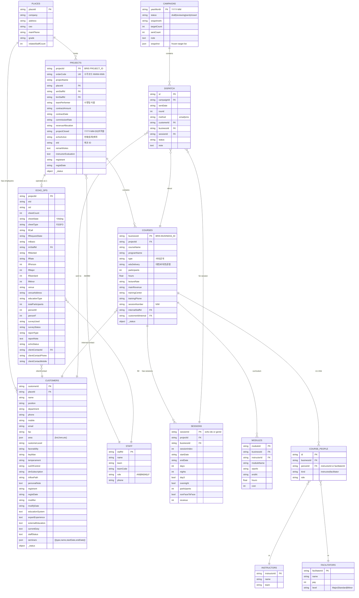

# CS 설문 대상자 관리 — 데이터 모델 v2 설계 스펙

> **Status**: Phase A (설계 고정) 산출물
> **작성일**: 2026-04-13
> **참조**: v1 문서 `data_flow.md`, 플랜 `~/.claude/plans/binary-shimmying-cosmos.md`
> **적용 범위**: `index.html` 단일 파일 (localStorage 기반)

---

## 1. Overview

### 1-1. v1 → v2 배경

v1(현재) 시스템은 BRIS 각 페이지에서 획득 가능한 ~77개 필드 중 약 **44개만 캡처**한다. 누락된 33개 필드 중에는 계약금액·수주일·AM팀·진행자 매출·차수 idx·DM 우호도/KeyMan/성향 등 **인터뷰·분석·분류에 유의미한 정보**가 다수 포함되어 있다.

또한 v1의 단일 `cs_courses` 스토어에 과정·강사·진행자·프로젝트·에코·DM 관련 필드가 뒤섞여 있어 관계형 질의(프로젝트 → 차수 → 담당자)가 어렵고, 같은 프로젝트에 속한 여러 과정이 동일 `project_view.asp`를 중복 fetch 하는 비효율이 있다.

### 1-2. v2 목표

| # | 목표 | 구현 수단 |
|---|---|---|
| 1 | **누락 없는 DB** | 13개 정규화 엔터티, 77개+ 필드 수용 |
| 2 | **수집 효율화** | 4-Phase 파이프라인 + unique set dedup |
| 3 | **상태 가시성** | 통일 `_status` 객체, UI 매트릭스 |
| 4 | **캠페인 자동화** | 스냅샷 기반 `draft → sent → closed` 상태머신 |
| 5 | **재수집 세분화** | 단계별 개별 재수집 API (`recollectStage`) |

### 1-3. 전환 전략 (확정)

**초기화 후 재수집**. 마이그레이션 로직 없음. 부팅 시 v1 데이터를 `cs_legacy_YYYYMMDD_*` 로 백업 후 삭제, 신규 스키마로 빈 상태 시작.

---

## 2. ERD



---

## 3. 엔터티 사전 (13개)

모든 엔터티 루트는 `id` 필드(엔터티별 의미 다름)와 `_status` / `_lastFetched` / `_errors` 객체를 가진다.

### 3-1. `places` — 사업장
| 필드 | 타입 | PK/FK | nullable | 출처 | 비고 |
|---|---|---|---|---|---|
| placeId | string | **PK** | N | place_view.asp `PLACE_ID`, dm_view.asp 링크 | BRIS 고유 |
| company | string | | N | dm_view "사업장" / project_view "고객사" | 회사명 |
| address | string | | Y | dm_view "주소" | |
| ceo | string | | Y | dm_view "대표자" | |
| mainPhone | string | | Y | dm_view "대표전화" | |
| grade | string | | Y | dm_view "사업장등급" | |
| relatedStaffCount | int | | Y | dm_view "동사업장 인원" 링크 텍스트 `16/(2)` | |
| _status | object | | N | - | `{place}` |

### 3-2. `customers` — 고객사 담당자 (DM)
| 필드 | 타입 | PK/FK | nullable | 출처 |
|---|---|---|---|---|
| customerId | string | **PK** | N | dm_view.asp `CUSTOMER_ID` |
| placeId | string | FK→places | Y | dm_view `place_view.asp?PLACE_ID=` 링크 |
| company | string | | N | dm_view |
| name | string | | N | dm_view "성명" |
| position | string | | Y | dm_view (성명 다음 단어) |
| department | string | | Y | dm_view "부서" |
| phone | string | | Y | dm_view "전화/휴대" 1행 |
| mobile | string | | Y | dm_view "전화/휴대" 2행 또는 `goSMS()` 파싱 |
| email | string | | Y | dm_view `a[href^="mailto:"]` |
| fax | string | | Y | dm_view "팩스" |
| area | object | | Y | dm_view "담당영역" 체크박스 `{hrd,hrm,etc}` |
| customerLevel | string | | Y | dm_view "고객레벨" |
| favorability | string | | Y | dm_view "우호도" |
| keyMan | string | | Y | dm_view "Key Man" |
| temperament | string | | Y | dm_view "성향" |
| outOfControl | string | | Y | dm_view "관리권밖" |
| dmSubscription | string | | Y | dm_view "DM수신여부" |
| inflowPath | string | | Y | dm_view `input[name="fromreg"]` |
| personalNote | text | | Y | dm_view "개인성향 및 기타메모" |
| registrant | string | | Y | dm_view 하단 "등록" 섹션 |
| registDate | string | | Y | 동일 |
| modifier | string | | Y | dm_view 하단 "수정" 섹션 |
| modifyDate | string | | Y | 동일 |
| educationSystem | text | | Y | dm_view "교육체계 교육현황" |
| expertExperience | text | | Y | dm_view "엑스퍼트 교육경험" |
| externalEducation | text | | Y | dm_view "외부 교육/위탁과정" |
| currentDuty | text | | Y | dm_view "현재 담당 업무" |
| staffStatus | text | | Y | dm_view "담당자 현황 및 비고" |
| seminars | array | | Y | dm_view 세미나 참석 테이블 |
| _status | object | | N | - |

### 3-3. `staff` — 내부 담당자 (AM·BM·IM·LF)
| 필드 | 타입 | PK/FK | nullable | 출처 |
|---|---|---|---|---|
| staffId | string | **PK** | N | 이름+팀 해시(genId) |
| name | string | | N | AM/BM/IM/LF 이름 |
| team | string | | Y | "서울2팀" 등 (echo 페이지 silver span, project_view AM 블록) |
| teamCode | string | | Y | `api_reference.md` 팀 코드 참조 |
| role | enum | | N | `AM\|BM\|IM\|LF` |
| phone | string | | Y | echo 페이지 `contactTel` |
| imNo | string | | Y | IM 전용, `select[name="im_no"] option.value` |

### 3-4. `instructors` — 강사
| 필드 | 타입 | PK/FK | nullable | 출처 |
|---|---|---|---|---|
| instructorId | string | **PK** | N | 이름 해시(genId), 동명이인은 팀 병기 |
| name | string | | N | program_mng `a[href*=inst_fee_edit]` 텍스트, project_view 강사평가 섹션 |
| team | string | | Y | project_view 에서 병기된 경우 |

### 3-5. `facilitators` — 진행자 (LF)
| 필드 | 타입 | PK/FK | nullable | 출처 |
|---|---|---|---|---|
| facilitatorId | string | **PK** | N | 이름 해시(genId) |
| name | string | | N | program_mng `al_person` 배열 `name`, echo_op `lf_want` |
| pay | int | | Y | `al_person` `totalCost`, echo_op `lf_pay` |
| level | enum | | Y | `Major\|Standard\|Minor` (echo_op `lf_job_1/2/3` 카운트에서 유도) |
| position | string | | Y | `al_person` `position` |

### 3-6. `projects` — 프로젝트 (수주코드 단위)
| 필드 | 타입 | PK/FK | nullable | 출처 |
|---|---|---|---|---|
| projectId | string | **PK** | N | project_view `input[name="PROJECT_ID"]` |
| orderCode | string | UK | Y | project_view `input[name="successCode"]` or 수주코드 td |
| projectName | string | | Y | project_view "프로젝트명" |
| placeId | string | FK→places | Y | 회사명으로 places 조회 후 연결 |
| amStaffId | string | FK→staff | Y | project_view AM 파싱 후 staff upsert |
| bmStaffId | string | FK→staff | Y | project_view BM 파싱 |
| teamPerformer | string | | Y | project_view "수행팀" |
| contractAmount | string | | Y | project_view "수주 및 계약금액" |
| contractDate | string | | Y | project_view "수주일" |
| commissionRate | string | | Y | project_view "수주 수수료율" |
| revenueAllocation | string | | Y | project_view "매출분할" |
| projectClosed | string | | N | project_view "프로젝트 마감" (기본 "미적용") |
| echoActive | string | | Y | project_view `button.btnEcho` 텍스트 |
| eId | string | | Y | project_view `project_echoview.asp?e_id=` 링크 or echoview 페이지 |
| remarkNotes | text | | Y | project_view "비고 및 특이사항" |
| instructorEvaluation | text | | Y | project_view "강사평가" |
| registrant | string | | Y | project_view "등록인" |
| registDate | string | | Y | project_view "등록일" |
| _status | object | | N | - |

### 3-7. `courses` — 교육 단위 (BUSINESS_ID)
| 필드 | 타입 | PK/FK | nullable | 출처 |
|---|---|---|---|---|
| businessId | string | **PK** | N | program_mng `input[name="businessId"]` |
| projectId | string | FK→projects | Y | program_mng `a[href*=project_view]` |
| courseName | string | | N | program_mng / 과정리스트 |
| programName | string | | Y | 동일 |
| type | enum | | Y | `사내\|공개` — 과정리스트 1열 |
| eduDelivery | enum | | Y | program_mng "비대면/대면" |
| participants | int | | Y | program_mng "인원/시간" 좌측, 과정리스트 6열 |
| hours | float | | Y | program_mng "인원/시간" 우측, 과정리스트 5열 |
| lectureRate | string | | Y | program_mng "강사료/시간" |
| mainRevenue | string | | Y | program_mng "주매출" |
| trainingCenter | string | | Y | program_mng "교육장" |
| trainingPhone | string | | Y | program_mng "교육장전화" |
| sessionNumber | string | | Y | program_mng "차수/총차수" |
| internalStaffId | string | FK→staff | Y | program_mng "담당자" = 내부 AM/사원 |
| customerIdInternal | string | FK→customers | Y | program_mng `a[href*=dm_view]` |
| am | string | | Y | 과정리스트 7열 (fallback용) |
| _status | object | | N | - |

### 3-8. `sessions` — 차수 (비즈니스 ID × 차수 인덱스)
| 필드 | 타입 | PK/FK | nullable | 출처 |
|---|---|---|---|---|
| sessionId | string | **PK** | N | echo `div[sDate].idx` or genId |
| projectId | string | FK→projects | N | biz_list / echo |
| businessId | string | FK→courses | Y | biz_list row |
| sessionIndex | int | | N | biz_list col 1 or echo div 순서 |
| startDate | string | | Y | biz_list / echo `sDate` |
| endDate | string | | Y | biz_list / echo `eDate` |
| days | int | | Y | echo `courseDay_d1` |
| nights | int | | Y | echo `courseDay_d2` |
| day3 | bool | | Y | echo `courseDay_d3` 존재 여부 |
| overnight | bool | | Y | echo `courseDay_night == 'Y'` |
| participants | int | | Y | echo `courseDay_person` |
| nonFaceToFace | bool | | Y | biz_list col 2 텍스트 존재 |
| revenue | int | | Y | biz_list col 5 |

### 3-9. `modules` — 강의 세부 일정
| 필드 | 타입 | PK/FK | nullable | 출처 |
|---|---|---|---|---|
| moduleId | string | **PK** | N | genId |
| businessId | string | FK→courses | N | program_mng |
| instructorId | string | FK→instructors | Y | row의 `inst_fee_edit` 링크 텍스트 |
| moduleName | string | | Y | row col 2 |
| startAt | string | | Y | row col 3 (ISO 변환) |
| endAt | string | | Y | 동일 |
| hours | float | | Y | row col 4 |
| cost | int | | Y | row col 5 |

### 3-10. `echo_ops` — 에코 운영 정보 (프로젝트당 1건)
| 필드 | 타입 | PK/FK | nullable | 출처 |
|---|---|---|---|---|
| projectId | string | **PK** | N | echo `const project_id` |
| eId | string | | Y | `const e_id` |
| sid | string | | Y | `const sid` |
| sheetCount | int | | Y | `const sheetCount` |
| sheetState | enum | | Y | `const sheetState` (Y/N/Ing) |
| sheetType | enum | | Y | `const sheetType` (F/O/FO) |
| lfCall | string | | Y | `const lf_call` |
| lfRequestState | string | | Y | `const lf_request_state` |
| mBasic | string | | Y | `const m_basic` |
| imStaffId | string | FK→staff | Y | `select[name="im_no"]` |
| lfWanted | string | | Y | `input[name="lf_want"]` |
| lfRate | string | | Y | `input[name="lf_pay"]` |
| lfPerson | int | | Y | `input[name="lf_person"]` |
| lfMajor | int | | Y | `input[name="lf_job_1"]` |
| lfStandard | int | | Y | `input[name="lf_job_2"]` |
| lfMinor | int | | Y | `input[name="lf_job_3"]` |
| venue | string | | Y | "연수원명" |
| venueAddress | string | | Y | "주소" |
| educationType | string | | Y | span.val "대면/비대면/혼합" |
| totalParticipants | int | | Y | "교육인원 총 ___ 명" |
| personM | int | | Y | `input[name="person_m"]` |
| personF | int | | Y | `input[name="person_w"]` |
| surveyUsed | string | | Y | `input[name="survey"]:checked` or 폴백 |
| surveyStatus | string | | Y | "설문지" td.title 다음 `span.val` |
| reportType | string | | Y | "결과보고서" `span.val.check` |
| reportNote | text | | Y | "결과보고서" `span.val.text` |
| echoStatus | string | | Y | `span.alert` 또는 echoActive 값 |
| clientContactId | string | FK→customers | Y | `select[name="im_contactor"] option.value` |
| clientContactPhone | string | | Y | "회사:" `span.contactTel` |
| clientContactMobile | string | | Y | "H.P:" `span.contactTel` |

### 3-11. `course_people` — 과정-사람 M:N
| 필드 | 타입 | PK/FK | nullable | 출처 |
|---|---|---|---|---|
| id | string | **PK** | N | genId |
| businessId | string | FK→courses | N | - |
| personId | string | FK | N | instructors or facilitators 의 PK |
| kind | enum | | N | `instructor\|facilitator` |
| role | string | | Y | 'main', 'sub', 'lf_major' 등 |

### 3-12. `campaigns` — 월별 캠페인
| 필드 | 타입 | PK/FK | nullable | 출처 |
|---|---|---|---|---|
| yearMonth | string | **PK** | N | `YYYY-MM` |
| status | enum | | N | `draft\|reviewing\|sent\|closed` |
| snapshotAt | string | | Y | 스냅샷 생성 ISO |
| targetCount | int | | N | 스냅샷의 대상 수 |
| sentCount | int | | N | 실제 발송된 수 |
| note | text | | Y | 운영자 메모 |
| snapshot | array | | Y | 스냅샷 시점의 타겟 레코드 사본 (freeze) |

### 3-13. `dispatch` — 발송이력 (구 history)
| 필드 | 타입 | PK/FK | nullable | 출처 |
|---|---|---|---|---|
| id | string | **PK** | N | genId |
| campaignId | string | FK→campaigns | Y | yearMonth |
| sentDate | string | | N | ISO |
| round | int | | N | 1차/2차 구분 |
| method | enum | | Y | `email\|sms` |
| customerId | string | FK→customers | N | - |
| businessId | string | FK→courses | Y | 대상 과정 |
| sessionId | string | FK→sessions | Y | 대상 차수 |
| status | string | | Y | '발송완료', '반송', '응답' 등 |
| note | text | | Y | - |

---

## 4. URL → 필드 매핑표 (완전판)

각 BRIS URL 에서 추출 가능한 **모든 필드**와 저장 목적지 엔터티.

### 4-1. `index_nopaging.asp` — 과정리스트 (진입점)
```
POST  /business/program/index_nopaging.asp
      { NICKNAME, PROGRAM, team_code, PM, inst, SD, ED, page }
```

| 필드 | 셀렉터 힌트 | 타겟 엔터티.필드 |
|---|---|---|
| businessId | `a[href*=program_mng.asp] BUSINESS_ID=` | courses.businessId |
| type | 테이블 1열 | courses.type |
| dateRange | 테이블 2열 `2026/03/16→03/17` | (파생: sessions 생성 시) |
| courseName | `td.mixTitle > a` | courses.courseName |
| programName | `td.mixTitle` 전체 − courseName | courses.programName |
| company | 테이블 4열 | places.company (upsert) |
| hours | 테이블 5열 | courses.hours |
| participants | 테이블 6열 | courses.participants |
| am | 테이블 7열 | courses.am (fallback) |
| totalCount | "전체 N건" 링크 | (진행률 UI) |
| nextPage | `a[href*=index.asp?page=]` | (페이지네이션) |

### 4-2. `program_mng.asp?DIVISION=1&BUSINESS_ID=` — 교육세부
| 필드 | 셀렉터 힌트 | 타겟 |
|---|---|---|
| businessId | `input#businessId` | courses.businessId |
| orderCode | `a[href*=project_view] text` | projects.orderCode (via businessId) |
| projectId | `href=project_view.asp?PROJECT_ID=` | projects.projectId, courses.projectId |
| company | `td[bgcolor=#DDECB4]` "회사명" 다음 | places.company |
| internalManager | "담당자" 다음 | courses.internalStaffId (이름→staff) |
| courseName, programName | "과정명"/"프로그램명" 다음 | courses.* |
| customerId (internal) | `a[href*=dm_view]` | courses.customerIdInternal |
| customerName | 동일 링크 텍스트 | customers.name (upsert) |
| participants, hours | "인원/시간" 다음 `N/M` 분리 | courses.* |
| trainingCenter, trainingPhone | "교육장"/"교육장전화" 다음 | courses.* |
| sessionNumber | "차수/총차수" 다음 | courses.sessionNumber |
| lectureRate | "강사료/시간" 다음 | courses.lectureRate |
| mainRevenue | "주매출" 다음 | courses.mainRevenue |
| eduDelivery | "비대면(온라인)" td 다음 | courses.eduDelivery |
| instructors[] | `a[href*=inst_fee_edit] text[]` | instructors (upsert) + course_people |
| facilitators[] | Vue `al_person` 배열 {name,totalCost,position} | facilitators (upsert) + course_people |
| modules[] | 강의일정 테이블 각 row | modules[] |

### 4-3. `project_view.asp?PROJECT_ID=` — 프로젝트 세부
| 필드 | 셀렉터 힌트 | 타겟 |
|---|---|---|
| projectId | `input[name="PROJECT_ID"]` | projects.projectId |
| orderCode | `input[name="successCode"]` or 수주코드 td | projects.orderCode |
| projectName | `td.bris_tb_title` "프로젝트명" 다음 | projects.projectName |
| company | "고객사" 다음 | places.company |
| am | "AM" 다음 첫 단어 | staff(role=AM) |
| team | "수행팀" 다음 | projects.teamPerformer |
| projectClosed | "프로젝트 마감" 다음 | projects.projectClosed |
| echoActive | `button.btnEcho` 텍스트 | projects.echoActive |
| contractAmount | "수주 및 계약금액" 다음 | projects.contractAmount |
| contractDate | "수주일" 다음 | projects.contractDate |
| commissionRate | "수주 수수료율" 다음 | projects.commissionRate |
| revenueAllocation | "매출분할" 다음 | projects.revenueAllocation |
| bm | "BM" 다음 | staff(role=BM) |
| instructorEvaluation | "강사평가" 다음 / 하단 강사 테이블 | projects.instructorEvaluation |
| remarkNotes | "비고 및 특이사항" 다음 | projects.remarkNotes |
| registrant | "등록인" 다음 | projects.registrant |
| registDate | "등록일" 다음 | projects.registDate |
| eId (via echoLink) | `a[href*=project_echoview.asp?e_id=]` | projects.eId |

### 4-4. `project_echoview.asp?e_id=` — 에코 요약
| 필드 | 셀렉터 힌트 | 타겟 |
|---|---|---|
| eId | `var e_id = "..."` | projects.eId |
| projectId | `a[href*=project_view] project_id=` | projects.projectId |
| orderCode | "수주코드" 다음 `\d{4}-\d{3}` | projects.orderCode |
| echoProjectName | "에코프로젝트명" 다음 `b` | (참고용) |
| company | "고객사" 다음 `b` | places.company |
| team | "수행팀" 다음 `b` (normalizeTeamName) | projects.teamPerformer |
| echoPeriod | "에코 운영기간" 다음 | (echo_ops 파생) |
| am, operationManager | "AM·운영" 다음 `b`[0]·`b`[1] | staff(role=AM), staff(role=IM) |
| amTeam | 위 td 내 `span[style*=silver]` | staff.team |
| clientContactRaw | "고객사 담당" 다음 | (참고) |

### 4-5. `echo/operate/main_2024.asp?project_id=` — 에코 운영상세 (가장 풍부)
| 필드 | 셀렉터 힌트 | 타겟 |
|---|---|---|
| project_id, e_id, sid | `const` 변수 | echo_ops.* |
| sheetCount, sheetState, sheetType | 동일 | echo_ops.* |
| lf_call, lf_request_state, m_basic | 동일 | echo_ops.* |
| company | "고객사" 다음 | places.company |
| educationType | `span.val` "대면/비대면/혼합" | echo_ops.educationType |
| totalParticipants | "총 ___ 명" 내 `span.val` | echo_ops.totalParticipants |
| personM, personF | `input[name=person_m/person_w]` | echo_ops.* |
| venue, venueAddress | "연수원명"·"주소" | echo_ops.* |
| operationIM (name) | `select[name=im_no] option[selected]` text | staff.name |
| imNo | 동일 option.value | staff.imNo, echo_ops.imStaffId |
| amName, amPhone, amTeam | "담당AM" td 내 `b`·`contactTel`·`silver span` | staff(role=AM) |
| clientContact, clientContactId, Position, Dept | `select[name=im_contactor]` option | customers (upsert) |
| clientContactPhone, Mobile | `span.contactTel` label match | echo_ops.* |
| echoStatus | `span.alert` 중 "에코 제외" | echo_ops.echoStatus |
| surveyUsed | `input[name=survey]:checked` | echo_ops.surveyUsed |
| reportType, reportNote | "결과보고서" `span.val.check/text` | echo_ops.* |
| surveyStatus | "설문지" 다음 `span.val` | echo_ops.surveyStatus |
| lfWanted, lfRate, lfPerson | `input[name=lf_want/lf_pay/lf_person]` | echo_ops.* |
| lfMajor, lfStandard, lfMinor | `input[name=lf_job_1/2/3]` | echo_ops.* |
| schedules[] | `div[sDate]` 반복 블록 | sessions[] |
| - sessionId | div `idx` 속성 | sessions.sessionId |
| - startDate, endDate | `sDate`, `eDate` | sessions.* |
| - days, nights | `courseDay_d1`, `courseDay_d2` | sessions.* |
| - day3, overnight | `courseDay_d3`, `courseDay_night` | sessions.* |
| - participants | `courseDay_person` | sessions.participants |

### 4-6. `project_biz_list.asp?successCode=&PROJECT_ID=` — 전체 차수
| 필드 | 셀렉터 힌트 | 타겟 |
|---|---|---|
| sessions[] | `a[href*=go_page]` row 순환 | sessions (정본) |
| - sessionIndex | tds[0] | sessions.sessionIndex |
| - nonFaceToFace | tds[1] 텍스트 존재 | sessions.nonFaceToFace |
| - startDate, endDate | link text `YYYY.MM.DD~DD` 파싱 | sessions.* |
| - courseName | tds[3] | sessions.courseName (부가) |
| - businessId | link href `go_page('...','N')` | sessions.businessId (⇒ courses 신규 trigger) |
| - revenue | tds[4] 숫자 | sessions.revenue |

### 4-7. `dm_view.asp?CUSTOMER_ID=` — DM 상세
| 필드 | 셀렉터 힌트 | 타겟 |
|---|---|---|
| customerId | `input[name="CUSTOMER_ID"]` | customers.customerId |
| placeId | `a[href*=place_view] PLACE_ID=` | customers.placeId, places.placeId |
| company | `a[href*=place_view] text` | places.company |
| grade | "사업장등급" 다음 | places.grade |
| address | "주소" 다음 | places.address |
| ceo | "대표자" 다음 | places.ceo |
| mainPhone | "대표전화" 다음 | places.mainPhone |
| name | "성명" 다음 (첫 단어) | customers.name |
| position | "성명" 다음 (둘째 단어) | customers.position |
| department | "부서" 다음 | customers.department |
| phone | "전화/휴대" 1행 | customers.phone |
| mobile | 동일 2행 / `goSMS('...')` | customers.mobile |
| fax | "팩스" 다음 | customers.fax |
| email | `a[href^=mailto:]` text | customers.email |
| area | "담당영역" 중첩 테이블 HRD/HRM/ETC 체크 | customers.area (json) |
| customerLevel | "고객레벨" 다음 | customers.customerLevel |
| favorability | "우호도" 다음 | customers.favorability |
| keyMan | "Key Man" 다음 | customers.keyMan |
| temperament | "성향" 다음 | customers.temperament |
| outOfControl | "관리권밖" 다음 | customers.outOfControl |
| dmSubscription | "DM수신여부" 다음 | customers.dmSubscription |
| inflowPath | `input[name="fromreg"]` | customers.inflowPath |
| personalNote | "개인성향 및 기타메모" 다음 | customers.personalNote |
| registrant, registDate | 중첩 "등록" 섹션 | customers.* |
| modifier, modifyDate | 중첩 "수정" 섹션 | customers.* |
| educationSystem | "교육체계 교육현황" 다음 | customers.* |
| expertExperience | "엑스퍼트 교육경험" 다음 | customers.* |
| externalEducation | "외부 교육/위탁과정 및 경쟁사" 다음 | customers.* |
| currentDuty | "현재 담당 업무" 다음 | customers.* |
| staffStatus | "담당자 현황 및 비고" 다음 | customers.* |
| seminars[] | 세미나 참석 테이블 | customers.seminars (json) |
| relatedStaffCount | "동사업장 인원" 링크 텍스트 | places.relatedStaffCount |

### 4-8. `place_view.asp?PLACE_ID=` — 사업장 상세 (선택 단계)
> 2026-04 시점 필요성 낮음. placeId 가 새로 발견되었고 기본 정보가 부족할 때만 fetch.

| 필드 | 타겟 |
|---|---|
| placeId, company, address, industry, scale, url, 기타 | places.* |

---

## 5. 상태 모델

### 5-1. `_status` 객체 스키마

모든 루트 엔터티(projects·courses·customers·places)에 부착:

```ts
type Stage = 'list' | 'project' | 'echoview' | 'echoOp' | 'bizList' | 'edu' | 'dm' | 'place';
type StageStatus = 'pending' | 'ok' | 'fail' | 'skip';

interface EntityStatus {
  _status:       Record<Stage, StageStatus>;
  _lastFetched:  Record<Stage, string>;    // ISO 8601
  _errors:       Record<Stage, string>;    // fail 시 에러 메시지
}
```

### 5-2. 상태 전이 규칙

| 전이 | 조건 |
|---|---|
| `pending → ok` | fetch 성공, extract 성공, apply 성공 |
| `pending → fail` | fetch 실패 or extract 실패 (throw 없이 catch) |
| `pending → skip` | 해당 단계 불가 (예: projectId 없음 → echoview/echoOp/bizList skip, placeId 없음 → place skip) |
| `fail → pending → ok` | 재수집 성공 |
| `ok → pending → ok` | 강제 재수집 |

실패는 절대 throw 하지 않고 `_errors[stage] = err.message` 에만 기록. 상위 루프는 다음 엔터티로 계속.

### 5-3. 엔터티별 관련 단계

| 엔터티 | 추적 단계 |
|---|---|
| courses | list, edu |
| projects | project, echoview, echoOp, bizList |
| customers | dm |
| places | place |

---

## 6. 수집 순서 (Phase 0~3)

**원칙**: 같은 정보원을 두 번 fetch 하지 않는다.

### 6-1. Phase 0 — 목록 수집
- 출처: `index_nopaging.asp` (자동 POST 순환) or `parseIntegratedPage` (수동 붙여넣기, 보조)
- 출력: `cs_courses` 기초 레코드 + `businessId` 집합
- 상태: `courses._status.list = 'ok'`

### 6-2. Phase 1 — 프로젝트 단위 수집 (unique projectId)
순서: 1-A → 1-B → 1-C → 1-D (각 단계 실패해도 다음 계속)

| 단계 | URL | 결과 |
|---|---|---|
| 1-A | `project_view.asp?PROJECT_ID=` | projects + places + staff(AM/BM) |
| 1-B | `project_echoview.asp?e_id=` (eId 있을 때만) | projects.amTeam·eId 보강 |
| 1-C | `echo/operate/main_2024.asp?project_id=` | echo_ops + sessions + customers(clientContact) + staff(IM) + facilitators |
| 1-D | `project_biz_list.asp?successCode=&PROJECT_ID=` | sessions 정본 교체 + 신규 businessId → courses 자동 등록 |

### 6-3. Phase 2 — 교육 단위 수집 (unique businessId)
- 출처: `program_mng.asp?BUSINESS_ID=`
- 출력: courses 상세 + modules + instructors + facilitators + course_people
- Phase 1-D 에서 새로 발견된 businessId 도 포함

### 6-4. Phase 3 — 사람·장소 단위 수집 (unique customerId, placeId)
| 단계 | URL | 결과 |
|---|---|---|
| 3-F | `dm_view.asp?CUSTOMER_ID=` | customers 전체 + places 기본 |
| 3-G (옵션) | `place_view.asp?PLACE_ID=` | places 보강 — placeId 새로 발견된 경우만 |

### 6-5. 진입점별 동작

| 진입 | 경로 |
|---|---|
| businessId 1건 | Phase 2-E → projectId 판명되면 Phase 1 → customerId 판명되면 Phase 3 |
| projectId 1건 | Phase 1 전체 → Phase 2 → Phase 3 |
| customerId 1건 | Phase 3 만 |
| 전체 재동기화 | Phase 0 → 1 → 2 → 3 순차 |

### 6-6. 구현 포인트

- `FetchQueue` 클래스가 세션 내 projectId·businessId·customerId·placeId unique set 유지
- 각 fetch 전 `queue.has(kind, id)` 체크 → skip
- fetch 후 `queue.mark(kind, id)` + `_lastFetched` 기록
- 단계별 delay 300ms (echo operate 는 500ms, 서버 부하 고려)

---

## 7. ID 결정 규칙

### 7-1. customerId (고객사 담당자 DM)

우선순위 체인 (초기화 ~ 병합 시):

```
1. echo_ops.clientContactId              (에코 운영의 `im_contactor`)
2. program_mng 의 dm_view 링크 customerId (교육세부 내부 담당자 — 보조)
3. 통합 페이지의 customerId              (v1 호환)
```

실제 발송 대상은 **echo_ops.clientContactId** 를 최우선. courses.customerIdInternal 은 내부 담당자로 별도 보존하되 발송에는 사용하지 않음.

### 7-2. projectId

```
1. program_mng 의 project_view 링크 PROJECT_ID=
2. project_view 페이지의 input[name="PROJECT_ID"]
3. echoview 의 project_view 링크 project_id=
```

중복 발견 시 동일해야 함. 불일치는 `_errors` 기록.

### 7-3. placeId

```
1. dm_view 의 place_view 링크 PLACE_ID=
2. places.company 완전 일치로 기존 placeId 탐색
3. 없으면 genId 로 신규 생성 (임시 ID, place_view fetch 시 BRIS ID 로 교체)
```

임시 placeId 는 `tmp_<hash(company)>` 접두사. place_view 수집 후 BRIS 실제 ID 로 교체하며 관련 FK 일괄 업데이트.

### 7-4. orderCode ↔ projectId

1:1 매핑으로 가정 (BRIS 구조). 새 페이지에서 두 값이 함께 등장하면 동시 갱신.

---

## 8. 정규화 규칙

### 8-1. 전화번호
기존 `normalizePhone` (`index.html:1427`) 유지. 형식: `02-3770-5576`, `010-9591-6461`.

### 8-2. 팀명
기존 `normalizeTeamName` (`:1621`) 유지. `"201205002 - 변화디자인팀"` → `"변화디자인팀"`.

### 8-3. 날짜
- 입력 형식: `2026.04.01`, `2026-04-01`, `2026/04/01`, `YYYYMMDD`, `2026-04-01 오전 10:00:36`
- 저장 형식: ISO 8601 `YYYY-MM-DD` (시각 필요 시 `YYYY-MM-DDTHH:mm`)
- `normalizeDate` + `parseBrisDate` 유지 + `oranoonToISO` 신규 ("오전/오후" 파싱)

### 8-4. 금액
- 입력: `"5,500,000원"`, `"220,000원/일"`, `"1,000"`
- 저장: 숫자 문자열 그대로 (콤마 + 단위 포함) — 표기 유지용
- 분석용 별도 필드가 필요하면 `{display, numeric}` 객체로 확장

### 8-5. 이름
- 공백·NBSP·전각 공백 → trim (`normalizeText` 유지)
- `"박철우 차장"` 같이 이름+직책 붙은 경우 공백 분리, `{name, position}` 각각 필드

### 8-6. 사람 매칭 (instructors·facilitators·staff)
- 1차: 이름 완전 일치
- 2차: 이름 + 팀 일치 (동명이인 대응)
- 3차: 이름 + 회사 일치 (customers 의 경우)
- 매칭 실패 시 신규 레코드 생성 (genId)

---

## 9. v1 → v2 매핑표 (참고)

실제 마이그레이션은 하지 않으나 이해 보조용:

| v1 필드 (cs_courses) | v2 엔터티.필드 |
|---|---|
| id | courses.businessId (또는 businessId 없으면 genId) |
| businessId | courses.businessId (PK 승격) |
| projectId | courses.projectId (FK) + projects.projectId |
| orderCode | projects.orderCode |
| company | places.company |
| courseName, programName | courses.* |
| type | courses.type |
| startDate, endDate, hours, participants | sessions 로 이동 + courses.hours·participants 는 요약 |
| am | staff(role=AM).name + projects.amStaffId |
| amTeam | staff.team |
| team | projects.teamPerformer |
| eduDelivery | courses.eduDelivery |
| internalManager | staff(role=내부 AM).name or courses.internalStaffId |
| customerId | courses.customerIdInternal |
| customerName | customers.name (via customerIdInternal 매칭) |
| instructors[] | instructors + course_people |
| facilitators[] | facilitators + course_people |
| echoActive | projects.echoActive |
| eId | projects.eId |
| projectClosed | projects.projectClosed |
| preSelected | (필터 로직 내부로 흡수) |
| excludeReason | courses.excludeReason (유지) |
| _fetchedEdu, _fetchedEcho, ... | courses._status.* |

| v1 필드 (cs_operations) | v2 |
|---|---|
| projectId | echo_ops.projectId (PK) |
| orderCode | projects.orderCode |
| company | places.company |
| educationType, totalParticipants | echo_ops.* |
| venue, venueAddress | echo_ops.* |
| operationIM | staff(role=IM).name + echo_ops.imStaffId |
| amName, amPhone | staff(role=AM).*  |
| amTeam (신규) | staff.team |
| clientContact, clientContactId, Position, Dept | customers (via customerId) |
| clientContactPhone, Mobile | echo_ops.clientContactPhone / Mobile |
| echoStatus, sheetState, surveyUsed | echo_ops.* |

| v1 (cs_schedules) | v2 |
|---|---|
| 전체 | sessions.* |

| v1 (cs_managers) | v2 |
|---|---|
| 전체 | customers.* + places.* (company 기준 분리) |

| v1 (cs_history) | v2 |
|---|---|
| 전체 | dispatch.* (campaignId 는 sentDate 의 yearMonth 로 역산) |

---

## 10. 부록

### 10-1. 설계 결정 기록

| 결정 | 사유 |
|---|---|
| places / customers 분리 | 한 회사의 여러 담당자를 단일 사업장에 묶어 "사업장 이력" 분석 가능 |
| staff 단일 테이블 (role 열) | AM/IM/LF/BM 을 하나로 — 동일 인물이 역할 전환 가능 |
| echo_ops 를 프로젝트당 1 레코드로 고정 | BRIS 가 PROJECT_ID 당 1 에코 운영 구조라 1:1 확정 |
| sessions PK 를 echo idx 기반으로 | 재수집해도 동일 세션에 매칭되도록 |
| course_people M:N 테이블 | 한 과정에 복수 강사, 한 강사가 여러 과정 |
| _status 를 enum 문자열로 | JSON 직렬화 용이, UI 에서 직접 렌더 가능 |
| 초기화 후 재수집 (마이그레이션 없음) | 마이그레이션 코드 복잡도·버그 제거, BRIS 재수집이 빠름 |

### 10-2. 미결 사항 (향후 세션에서 결정)

- [ ] 대규모 데이터(>1000 과정) 시 localStorage 5MB 한계 도달 가능성 — IndexedDB 이관 검토
- [ ] BRIS 프록시 (`/default.asp?bris_proxy=`) 를 통한 자동 수집의 서버 부하 한도 확인
- [ ] DM 세미나 이력 필드의 실제 사용처 — 분석 가치 확인 후 수집 여부 결정
- [ ] dispatch 의 응답 상태(수신/열람/응답) 추적 — 발송 채널 확정 후

### 10-3. 관련 문서

- `data_flow.md` — v1 시스템 상세 설명 (참고용 유지)
- `api_reference.md` — BRIS API (대시보드 집계, 이번 작업 범위 밖)
- `~/.claude/plans/binary-shimmying-cosmos.md` — 재설계 전체 플랜

---

**Phase A 완료.** 이 문서를 기준으로 Phase B (스키마 + 초기화) 착수.
